<div align="center">

# 👨‍💻 Nicholas Mureithi


</div>

---

## 🚀 About Me

```javascript
const developer = {
    location: "Nairobi, Kenya 🇰🇪",
    education: "Software Engineering @ Zetech University",
    currentFocus: ["Full-Stack Development", "Machine Learning", "Mobile Apps"],
    funFact: "I debug with coffee ☕ and deploy with confidence 🚀",
    lifePhilosophy: "Code is poetry that computers understand",
    currentlyListeningTo: "Lo-fi beats while coding",
    
    getRandomSkill() {
        const skills = this.currentFocus;
        return skills[Math.floor(Math.random() * skills.length)];
    }
};

console.log(`🎯 Currently working on: ${developer.getRandomSkill()}`);
```


🎯 **Mission:** Transforming ideas into elegant, scalable solutions that make a real-world impact.

🌱 **Currently mastering:** Next.js, FastAPI, and NLP (SpaCy, NLTK)

💡 **Open to:** Collaborations, internships, and innovative project ideas

📚 **Learning Philosophy:** Code daily, break things, learn, repeat

🎮 **When not coding:** Exploring new tech, gaming, or brainstorming the next big idea

<br clear="right"/>

---

## 🛠️ Tech Arsenal

<div align="center">

### 💻 Languages
<p>


</p>

### 🚀 Frameworks & Libraries
<p>


</p>

### 🛠️ Tools & Platforms
<p>


</p>

</div>

---

## 🎯 Featured Projects

<table align="center">
<tr>
<td width="50%" valign="top">

### 💸 PesaPal App
[](https://github.com)
[](https://github.com)

Smart budgeting tool designed specifically for students dealing with irregular income streams. Features intelligent expense tracking and savings goals.

**Key Features:**
- 📊 Adaptive budgeting algorithm
- 💰 Income pattern analysis
- 🎯 Goal-based savings tracker
- 📱 Clean, intuitive UI

</td>
<td width="50%" valign="top">

### 🏨 Hotel Booking Platform
[](https://github.com)
[](https://github.com)

Modern full-stack hotel reservation system with real-time availability and seamless booking experience.

**Key Features:**
- 🔍 Advanced search & filters
- 💳 Secure payment integration
- 📧 Email notifications
- 🗓️ Real-time availability

</td>
</tr>

<tr>
<td width="50%" valign="top">

### 🧠 Smart Resume Analyzer
[](https://github.com)
[](https://github.com)

AI-powered resume screening tool using NLP to match candidates with job descriptions and provide compatibility scores.

**Key Features:**
- 🤖 ML-based skill extraction
- 📈 Job match scoring
- 📄 Multi-format support (PDF, DOCX)
- 🎯 Keyword optimization tips

</td>
<td width="50%" valign="top">

### 🗣️ Personal AI Assistant
[](https://github.com)
[](https://github.com)

Conversational AI assistant that helps with coding queries, productivity tasks, and learns from user interactions.

**Key Features:**
- 🎤 Voice recognition
- 💬 Context-aware responses
- 🔧 Code snippet generation
- 📚 Learning & adaptation

</td>
</tr>
</table>

<div align="center">

### 🔥 More Projects Coming Soon...
*Currently cooking up some exciting ideas! 🚀*

</div>

---

## 📊 GitHub Stats

<div align="center">
  


</div>

<div align="center">
  
</div>

---

## 🏆 Coding Journey

```mermaid
graph LR
    A[🎓 Student] --> B[💻 Learning]
    B --> C[🛠️ Building]
    C --> D[🚀 Deploying]
    D --> E[🌟 Innovating]
    E --> F[👨‍🏫 Mentoring]
    
    style A fill:#6366f1
    style B fill:#8b5cf6
    style C fill:#a855f7
    style D fill:#c026d3
    style E fill:#d946ef
    style F fill:#e879f9
```

<div align="center">



</div>

### 💡 Current Focus Areas

<table>
<tr>
<td width="33%" align="center">

<br><strong>Web Development</strong>
<br>Building responsive, scalable full-stack applications
</td>
<td width="33%" align="center">

<br><strong>Machine Learning</strong>
<br>Creating intelligent systems with Python & TensorFlow
</td>
<td width="33%" align="center">

<br><strong>Mobile Development</strong>
<br>Crafting native Android apps with Kotlin
</td>
</tr>
</table>

---

## 🎯 2025 Goals Tracker

<div align="center">

| Goal | Progress | Status |
|------|----------|--------|
| 🚀 Master Next.js & FastAPI | ████████░░ 80% | 🔥 In Progress |
| 🤖 Build 3 ML Projects | ██████░░░░ 60% | 💪 Working On It |
| 📱 Launch Mobile App | ████░░░░░░ 40% | 🎯 On Track |
| 💼 Secure Internship | ██░░░░░░░░ 20% | 🎓 Applying |
| 🌟 Contribute to Open Source | ████░░░░░░ 40% | 💻 Active |

</div>

---

## 🌐 Connect With Me

<div align="center">

<a href="https://www.linkedin.com/in/nicholas-mureithi">

</a>
<a href="mailto:your.email@example.com">

</a>
<a href="https://twitter.com/yourhandle">

</a>
<a href="https://yourportfolio.com">

</a>

<br><br>

### 📧 Let's Build Something Amazing Together!


</div>

---

<div align="center">

### 💭 Code Philosophy

> *"First, solve the problem. Then, write the code."* - John Johnson

> *"Any fool can write code that a computer can understand. Good programmers write code that humans can understand."* - Martin Fowler


---


**✨ Thanks for visiting! Let's connect and build the future together! ✨**


</div>
